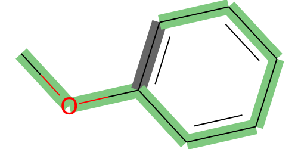

# Install  

For using Graph Neural Network to predict chemical biodegradation, you will install some package. The key packages on this research are be listed below:

RDKit: [Open-Source Cheminformatics Software.](http://www.rdkit.org/) 

PyTorch: [An open source machine learning framework.](https://pytorch.org/) 

DGL: [DEEP GRAPH LIBRARY.](https://www.dgl.ai/)

DGL-LifeSci: [Bringing Graph Neural Networks to Chemistry and Biology](https://lifesci.dgl.ai/index.html)

You can easily install the environment on this research using conda.

```
conda env create -f environment.yml 
```


# How to use?

```python
import dgl
from dgllife.utils import smiles_to_bigraph, CanonicalAtomFeaturizer, CanonicalBondFeaturizer
from dgllife.data import MoleculeCSVDataset
from torch.utils.data import DataLoader
import torch
import torch.nn.functional as F
import dgllife
from model import MyGAT
from rdkit import Chem
from argparse import Namespace

```


```python
args = Namespace(
    device = 'cpu',
    model_file   = '../model/3/GAT.pt',
    example_file = '../dataset/example.csv',
    result_file    = "../dataset/result.csv",
    # -----------------------model hyperparameters------------------------
    in_feats =  74,
    n_classes = 2,
    hidden_feats = [14] * 4, 
    activations  = [F.celu] * 4,
    residuals    = [True] * 4,
    dropouts = [0.2] * 4,
    num_heads = [4] * 4,
    feat_drops = [0.2] * 4,
    attn_drops = [0.2] * 4,
    agg_modes = ['flatten'] * 4,
)

```


```python
def smile_to_graph(smile, node_featurizer, edge_featurizer):
    graph = smiles_to_bigraph(smile, 
                             node_featurizer = CanonicalAtomFeaturizer(atom_data_field='h'),
                             edge_featurizer = CanonicalBondFeaturizer(bond_data_field='e')
    )
    graph = dgl.remove_self_loop(graph)
    graph = dgl.add_self_loop(graph)
    return graph
```


```python
def fit(args, model, graphs):
    graphs = graphs.to(args.device)
    node_feats = graphs.ndata.pop('h').to(args.device)
    return model(graphs, node_feats)
```

## 1. If you just want to predict a few of chemicals.


```python
## step 1. translate smiles to graphs
smiles =  ['CC1CCCCC1OC(C)=O', 'CCC(O)CO', 'CCCCCCCC\C=C/CCCCCCCC(O)=O', 
           'COc1cc(ccc1N)[N+]([O-])=O', 'CCCC[Sn](=O)CCCC','CCCC[Sn](=O)CCCC']

graphs  = [smile_to_graph(smile, None, None) for smile in smiles]
bg = dgl.batch(graphs)  
```


```python
## step 2: load model
myGAT = MyGAT(args)
myGAT.load_state_dict(torch.load(args.model_file, map_location=torch.device('cpu')))
```


    <All keys matched successfully>


```python
output, readout, att = fit(args, myGAT, bg)
torch.argmax(output, dim=1)
# Zero represents ready biodegradation and one is non-ready biodegradation.
```


    tensor([0, 0, 0, 1, 1, 1])


## 2. If you want to predict for a large number of chemicals, I suggest you should compile those chemicals into a csv file.


```python
# step 1. read chemicals file
import pandas as pd
data_file = pd.read_csv(args.example_file)
data_file.head()
```


<<<<<<< HEAD


>>>>>>> 
=======
<div>

>>>>>>> 76a901b525ffb0037d752048301cd2905daed59e
<table border="1" class="dataframe">
  <thead>
    <tr style="text-align: right;">
      <th></th>
      <th>smiles</th>
    </tr>
  </thead>
  <tbody>
    <tr>
      <th>0</th>
      <td>CCCCCCCCCCCCCCC</td>
    </tr>
    <tr>
      <th>1</th>
      <td>NCCCCCCN</td>
    </tr>
    <tr>
      <th>2</th>
      <td>OCCNCCO</td>
    </tr>
    <tr>
      <th>3</th>
      <td>CCCCCCCCCCCCCCCCCCOC(=O)CCSCCC(=O)OCCCCCCCCCCC...</td>
    </tr>
    <tr>
      <th>4</th>
      <td>CCOC(=O)C=C</td>
    </tr>
  </tbody>
</table>
</div>


```python
def collate_molgraphs(data):
    """Batching a list of datapoints for dataloader.

    Parameters
    ----------
    data : list of 3-tuples or 4-tuples.
        Each tuple is for a single datapoint, consisting of
        a SMILES, a DGLGraph, all-task labels and optionally a binary
        mask indicating the existence of labels.

    Returns
    -------
    smiles : list
        List of smiles
    bg : DGLGraph
        The batched DGLGraph.
    labels : Tensor of dtype float32 and shape (B, T)
        Batched datapoint labels. B is len(data) and
        T is the number of total tasks.
    masks : Tensor of dtype float32 and shape (B, T)
        Batched datapoint binary mask, indicating the
        existence of labels.
    """
    if len(data[0]) == 3:
        smiles, graphs, labels = map(list, zip(*data))
    else:
        smiles, graphs, labels, masks = map(list, zip(*data))

    bg = dgl.batch(graphs)
    bg.set_n_initializer(dgl.init.zero_initializer)
    bg.set_e_initializer(dgl.init.zero_initializer)
    labels = torch.stack(labels, dim=0)

    if len(data[0]) == 3:
        masks = torch.ones(labels.shape)
    else:
        masks = torch.stack(masks, dim=0)

    return smiles, bg, labels, masks

def get_dataloader(df, batch_size, collate_fn):
    dataset = MoleculeCSVDataset(df = df, 
                                 smiles_to_graph=smile_to_graph,
                                 node_featurizer = None,
                                 edge_featurizer = None,
                                 smiles_column='Smiles', 
                                 cache_file_path="./degradation_example.bin")
    if not get_dataset:
        return DataLoader(dataset = dataset, batch_size = batch_size, shuffle = shuffle, collate_fn = collate_fn)
    else:
        return dataset, DataLoader(dataset = dataset, batch_size = batch_size, shuffle = shuffle, collate_fn = collate_fn)
```


```python
## step 2. make datset
batch_size = 10
dataset = MoleculeCSVDataset(df = data_file, 
                                 smiles_to_graph=smile_to_graph,
                                 node_featurizer = None,
                                 edge_featurizer = None,
                                 smiles_column='smiles', 
                                 cache_file_path="./degradation_example.bin")
data_loader = DataLoader(dataset = dataset, batch_size = batch_size, collate_fn = collate_molgraphs)
```

    Processing dgl graphs from scratch...


```python
## setp 3. load model
myGAT = MyGAT(args)
myGAT.load_state_dict(torch.load(args.model_file, map_location=torch.device('cpu')))
```


    <All keys matched successfully>


```python
## step 4. fit
myGAT.eval()
result = []
for idx, data in enumerate(data_loader):
    smiles, graphs, _,_ = data
    logits, readout, att = fit(args, myGAT, graphs)
    result.extend(torch.argmax(logits.detach(), dim=1).tolist())
#result
```


```python
## step 5. save result
result =  pd.DataFrame(result)
result.to_csv(args.result_file, index=None, header=None)
```

## 3. If you want to observe attention score on chemicals structure


```python
from functools import partial
from IPython.display import SVG, display
import matplotlib
import matplotlib.cm as cm
from rdkit.Chem import rdDepictor
from rdkit.Chem.Draw import rdMolDraw2D
```


```python
def svg_draw(mol, g, node_attention, bond_attention):
    """
        mol_to_svg:
        args:
            mol: mol object of rdkit
            grapg: 
            node_attention: 节点attention
            bond_attention: 节点attention
        return: svg
    """
    # 绘制edge_attention
    min_value = torch.min(bond_attention)
    max_value = torch.max(bond_attention)
    bond_attention = (bond_attention - min_value) // (max_value - min_value) # normalization
    # Conver the weights to atom colors
    #norm = matplotlib.colors.Normalize(vmin=0, vmax=1.0)
    norm = matplotlib.colors.Normalize(vmin=min_value, vmax=max_value)
    cmap = cm.get_cmap('Accent')
    plt_colors = cm.ScalarMappable(norm=norm, cmap=cmap)
    bond_colors = {i: plt_colors.to_rgba(bond_attention[i*2].data.item()) for i in range((g.number_of_edges()-g.number_of_nodes())//2)}

    rdDepictor.Compute2DCoords(mol)
    drawer = rdMolDraw2D.MolDraw2DSVG(500,250)
    drawer.SetFontSize(1)
    op = drawer.drawOptions()

    mol = rdMolDraw2D.PrepareMolForDrawing(mol)
    #print(len(bond_colors), len(list(range(g.number_of_edges() // 2))))
    drawer.DrawMolecule(mol,highlightAtoms=None,highlightBonds=list(range(len(bond_colors))), highlightBondColors=bond_colors)

    drawer.FinishDrawing()
    svg = drawer.GetDrawingText()
    svg = svg.replace('svg:','')
    return svg
```


```python
def draw(mol_idxs,  dataset, model, col=None):
    """Visualize the learned atom weights in readout && bond attention.
    
    Parameters
    ----------
    mol_id : int
        Index for the molecule to visualize in the dataset.
    dataset
        As the model has multiple rounds of readout, an additional
        index is used to specify the round for the weights.
    """
    # Get the weights from the model.

    smiles = []
    graphs = []
    for idx in mol_idxs:
        smile, g, _, _ = dataset[idx]
        smiles.append(smile)
        graphs.append(g)
    
    bg = dgl.batch(graphs)  

    logit, readout, bond_attentions = fit(args, model, bg)
    bond_attention_split = []
    if col is not None: 
        bond_attentions = torch.squeeze(bond_attentions)[:, col]
        for i in range(len(bg.batch_num_edges())):
            if i == 0:
                bond_attention = bond_attentions[0:bg.batch_num_edges()[0].item()]
            else:
                bond_attention = bond_attentions[
                    torch.sum(bg.batch_num_edges()[:i]).item():
                    torch.sum(bg.batch_num_edges()[:i+1]).item()]
            bond_attention_split.append(bond_attention)
    else:
        for i in range(len(bg.batch_num_edges())):
            if i == 0:
                bond_attention, _= torch.max(bond_attentions[0:bg.batch_num_edges()[0].item()], dim=1)
            else:
                bond_attention, _= torch.max(bond_attentions[
                    torch.sum(bg.batch_num_edges()[:i]).item() :
                    torch.sum(bg.batch_num_edges()[:i+1]).item()
                    ], dim=1)
                bond_attention = torch.tensor([1 if i > 0.5 else  0 for i in bond_attention.detach().cpu()])
            bond_attention_split.append(bond_attention)
    mols = [Chem.MolFromSmiles(s) for s in smiles]

    svgs = [svg_draw(mols[i], graphs[i], None, bond_attention_split[i].squeeze()) for i in range(len(graphs))]
    for i in range(len(graphs)):
        display(SVG(svgs[i]))
```


```python
dataset = MoleculeCSVDataset(df = data_file, 
                                 smiles_to_graph=smile_to_graph,
                                 node_featurizer = None,
                                 edge_featurizer = None,
                                 smiles_column='smiles', 
                                 cache_file_path="./degradation_dataset.bin")
# step 1. you should specify index on dataste that you want to draw.                 
draw_list =  list(range(0,10))
# step 2. load model
myGAT = MyGAT(args)
myGAT.load_state_dict(torch.load(args.model_file, map_location=torch.device('cpu')))
# step 3. draw
draw(draw_list,  dataset, myGAT, col=None)
```

    Processing dgl graphs from scratch...


    


    


    


    


    


    


    


    


    



    


```python

```
